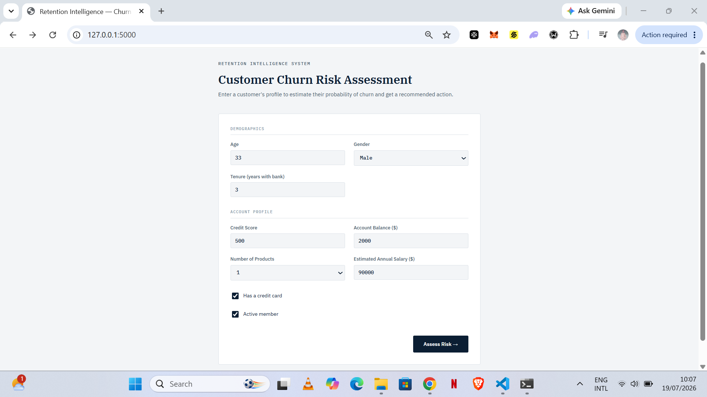
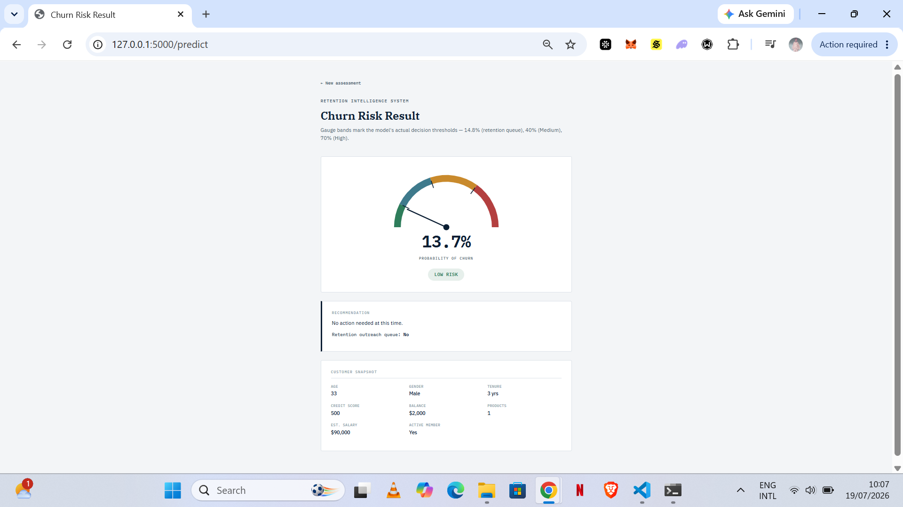

# Bank Customer Churn Prediction & Retention Intelligence System

A machine learning system that estimates a bank customer's probability of churning and gives a relationship manager a clear, actionable recommendation — built end-to-end from business framing through a deployed Flask app.

This isn't just a "trained a model, got 85% accuracy" notebook. It's an attempt to build something closer to what an actual retention team would use: a calibrated probability, a threshold chosen for business reasons rather than a scikit-learn default, and a fairness review that changed which features made it into the final model.

---

## The Business Problem

Banks lose customers every year, and by the time a customer closes their account, it's too late to intervene. This project asks: **can we identify at-risk customers early enough that a relationship manager can actually act** — a loyalty offer, a check-in call, a review of their account — before they leave?

If it works, the payoff is straightforward: fewer customers lost, lower acquisition costs to replace them, and retention spend that's targeted rather than blanket.

---

## Dataset

[Bank Customer Churn Modeling dataset](https://www.kaggle.com/datasets/shantanudhakadd/bank-customer-churn-prediction) — 10,000 customers, 14 columns (credit score, geography, gender, age, tenure, balance, product count, activity status, estimated salary, and churn outcome). No missing values, no duplicates.

---

## Key Findings from EDA

| Question | Finding |
|---|---|
| Which age group churns most? | Peaks at 50-60 (56% churn), then drops for 60+ (25%) — not a straight line |
| Do inactive members churn more? | Yes — 26.9% vs 14.3% for active members |
| Does country matter? | Germany churned at 32.4% vs ~16% for France/Spain (see Fairness section — this was ultimately excluded from the model) |
| Do more products mean more loyalty? | **No — and this is the standout finding.** Churn is lowest at 2 products (7.6%), but spikes to 82.7% at 3 products and 100% at 4. Likely reflects customers being sold extra products as a last-ditch retention attempt before leaving, rather than genuine engagement. Flagged as a segment worth investigating, not a "sell more products" signal. |
| Does tenure matter? | Barely — churn stays flat (17-23%) regardless of years with the bank |
| Does credit score matter? | Almost not at all by raw correlation (-0.03), though it still carried modest importance in the trained model — a good example of a tree-based model picking up non-linear/interaction effects that a simple correlation misses |

---

## Modeling

Four classifiers were trained and compared: Logistic Regression, Decision Tree, Random Forest, and KNN.

| Model | Accuracy | Precision | Recall | F1 | ROC-AUC |
|---|---|---|---|---|---|
| **Random Forest** | 0.842 | 0.605 | 0.636 | 0.620 | **0.861** |
| KNN | 0.849 | 0.777 | 0.359 | 0.491 | 0.829 |
| Decision Tree | 0.758 | 0.444 | 0.764 | 0.562 | 0.828 |
| Logistic Regression | 0.714 | 0.387 | 0.700 | 0.499 | 0.777 |

**Random Forest was selected — deliberately not the model with the highest raw accuracy.** KNN scored higher on accuracy but only caught 36% of actual churners, since it leaned on predicting "stays" for most customers (the majority class). Accuracy alone is misleading on an imbalanced target; ROC-AUC and recall are what actually reflect the business goal here.

After hyperparameter tuning (`GridSearchCV`, 5-fold CV) and probability calibration (`CalibratedClassifierCV`, isotonic), the final Random Forest reaches an ROC-AUC of **~0.85-0.86**.

---

## The Recall Decision

The business priority here is **catching at-risk customers**, not being conservative about who gets flagged — missing a churner costs the bank that customer's full lifetime value, while a false alarm just costs a phone call or a small offer. That asymmetry justified moving the decision threshold well below the default 0.5.

**Final threshold: catches ~81% of actual churners**, at the cost of roughly 2 false positives for every correct catch. That tradeoff is stated plainly here rather than hidden — it's a deliberate, business-justified choice, not an unexplained weak spot.

---

## Fairness Considerations

This is the section I'd point to as the most important part of the project, not an afterthought.

- **`Surname` was dropped early** — beyond having no predictive value, a surname can act as a proxy for ethnicity or national origin.
- **`Geography` was a real, moderate predictor** (Germany churned at ~2x the rate of France/Spain, ~4.6% feature importance) but was **removed from the final model.** National origin is a protected characteristic under the U.S. Equal Credit Opportunity Act (ECOA), and a system that systematically treats customers differently *because of their country* risks resembling the kind of profiling that law exists to prevent — even when the pattern is statistically real. Removing it cost about 1.4 points of ROC-AUC (0.863 → 0.851), a tradeoff accepted deliberately.
- **`Gender` and `Age` were kept.** Both are also on ECOA's protected list, and both are used here — the reasoning being that ECOA governs *credit-access* decisions specifically, and this is a retention-outreach tool rather than a lending decision. This is a judgment call, not a settled legal line, and it's flagged here as something that would warrant a compliance review before any real-world use, rather than presented as an obviously correct answer.

---

## The Application

A Flask web app where a relationship manager enters a customer's profile and receives:
- A calibrated churn probability
- A risk tier (Low / Elevated / Medium / High)
- A specific recommendation
- Whether the customer clears the retention-outreach threshold

The results page features a gauge visualization where the color bands and tick marks are placed at the model's **actual decision thresholds** (not arbitrary round numbers) — the same 81%-recall cutoff, and the 40%/70% tier boundaries, that drive the underlying logic.

### Screenshots



---

## Tech Stack

- **Modeling**: Python, pandas, scikit-learn (RandomForestClassifier, GridSearchCV, CalibratedClassifierCV)
- **App**: Flask, Jinja2
- **Frontend**: hand-built HTML/CSS (no framework), inline SVG for the gauge

---

## Running Locally

```bash
git clone https://github.com/pur3bliss/bank-churn-retention
cd bank-churn-retention
pip install -r requirements.txt
python app.py
```
Then open `http://127.0.0.1:5000` in your browser.

---

## Known Limitations

- The Flask form does not currently validate input ranges (e.g. a negative age would be silently accepted and passed to the model). Fine for a portfolio demo; would need hardening for real use.
- The model was trained on a single static dataset snapshot. A production version would need monitoring for data/concept drift over time and a retraining schedule.
- The Gender/Age fairness question above is explicitly unresolved and would need legal/compliance input before any real deployment.

---

## Project Structure

```
bank-churn-retention/
├── app.py
├── churn_model.joblib
├── requirements.txt
├── project_new.ipynb
├── templates/
│   ├── index.html
│   └── result.html
└── static/
    └── style.css
```
